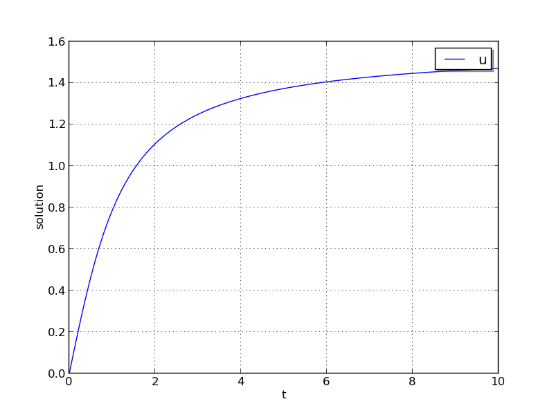
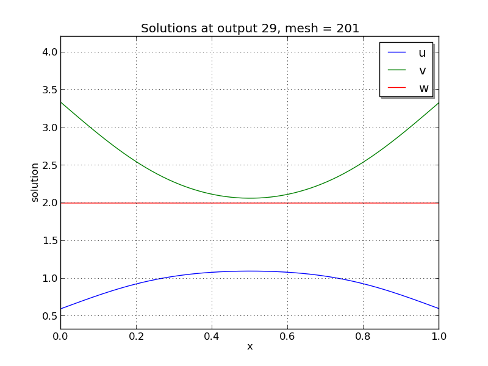
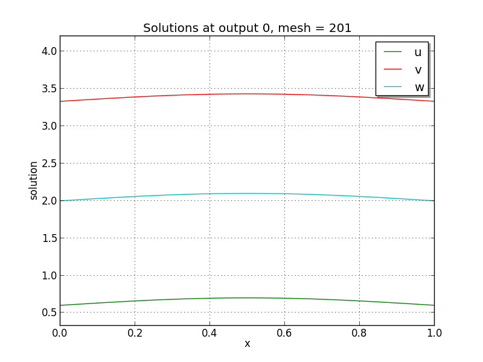
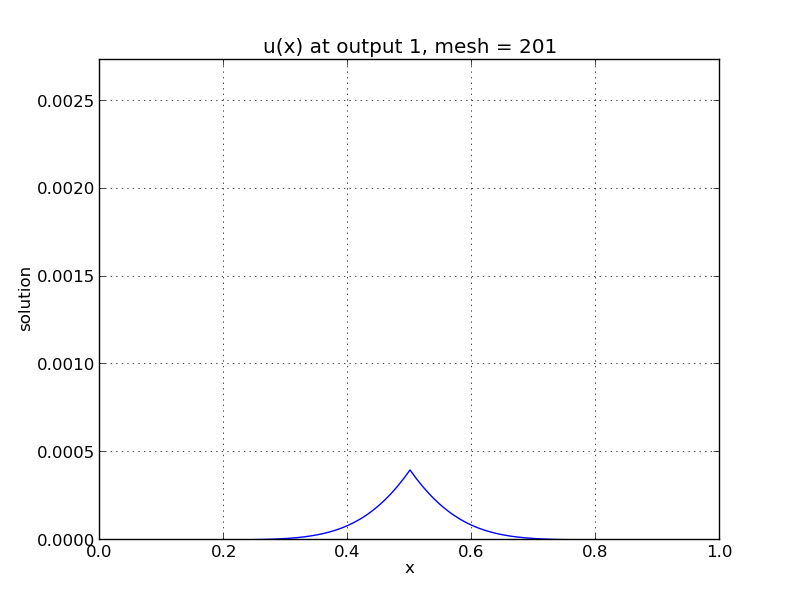

..
   Programmer(s): Daniel R. Reynolds @ SMU
   ----------------------------------------------------------------
   SUNDIALS Copyright Start
   Copyright (c) 2002-2021, Lawrence Livermore National Security
   and Southern Methodist University.
   All rights reserved.

   See the top-level LICENSE and NOTICE files for details.

   SPDX-License-Identifier: BSD-3-Clause
   SUNDIALS Copyright End
   ----------------------------------------------------------------

:tocdepth: 3

.. _serial_c:

====================================
Serial C example problems
====================================

.. _ark_analytic:

ark_analytic
====================================

This is a very simple C example showing how to use the ARKode solver
interface.

The problem is that of a scalar-valued initial value problem (IVP)
that is linear in the dependent variable :math:`y`, but nonlinear in
the independent variable :math:`t`:

.. math::

   \frac{dy}{dt} = \lambda y + \frac{1}{1+t^2} - \lambda \arctan(t),

where :math:`0\le t\le 10` and :math:`y(0)=0`.  The stiffness of the
problem may be tuned via the parameter :math:`\lambda`.  The value of
:math:`\lambda` must be negative to result in a well-posed problem;
for values with magnitude larger than 100 or so the problem becomes
quite stiff.  Here, we choose :math:`\lambda=-100`.  After each unit
time interval, the solution is output to the screen.

Numerical method
----------------

The example routine solves this problem using a diagonally-implicit
Runge-Kutta method.  Each stage is solved using the built-in modified
Newton iteration, but since the ODE is linear in :math:`y` these
should only require a single iteration per stage.  Internally, Newton
will use the SUNLINSOL_DENSE linear solver via the ARKDLS interface,
which in the case of this scalar-valued problem is just division.  The
example file contains functions to evaluate both :math:`f(t,y)` and
:math:`J(t,y)=\lambda`.  

We specify the relative and absolute tolerances, :math:`rtol=10^{-6}`
and :math:`atol=10^{-10}`, respectively.  Aside from these choices,
this problem uses only the default ARKode solver parameters.

Solutions
---------

This problem is included both as a simple example, but also because it
has an analytical solution, :math:`y(t) = \arctan(t)`.  As seen in the
plots below, the computed solution tracks the analytical solution
quite well (left), and results in errors below those specified by the input
error tolerances (right).

.. image:: figs/plot-ark_analytic_error.png
   :width: 45 %

.. _ark_analytic_nonlin:

ark_analytic_nonlin
==============================================

This example problem is only marginally more difficult than the
preceding problem, in that the ODE right-hand side function is
nonlinear in the solution :math:`y`.  While the implicit solver from
the preceding problem would also work on this example, because it is
not stiff we use this to demonstrate how to use ARKode's explicit
solver interface.  Although both the ARKStep and ERKStep time stepping
modules are appropriate in this scenario, we use the ERKStep module
here. 

The ODE problem is

.. math::

   \frac{dy}{dt} = (t+1) e^{-y},

for the interval :math:`t \in [0.0, 10.0]`, with initial condition
:math:`y(0)=0`.  This has analytical solution :math:`y(t) =
\log\left(\frac{t^2}{2} + t + 1\right)`.  

Numerical method
----------------

This program solves the problem with the default ERK method.  Output
is printed every 1.0 units of time (10 total). 
Run statistics (optional outputs) are printed at the end.
   

Solutions
---------

As seen in the plots below, the computed solution tracks the
analytical solution quite well (left), and results in errors
comparable with those specified by the requested error tolerances
(right).

.. image:: figs/plot-ark_analytic_nonlin.png
   :width: 45 %
.. image:: figs/plot-ark_analytic_nonlin_error.png
   :width: 45 %

.. _ark_brusselator:

ark_brusselator
================================================

We now wish to exercise the ARKode solvers on more challenging
nonlinear ODE systems.  The following test simulates a brusselator
problem from chemical kinetics, and is widely used as a standard
benchmark problem for new solvers.  The ODE system has 3 components,
:math:`Y = [u,\, v,\, w]`, satisfying the equations, 

.. math::

   \frac{du}{dt} &= a - (w+1)u + v u^2, \\
   \frac{dv}{dt} &= w u - v u^2, \\
   \frac{dw}{dt} &= \frac{b-w}{\varepsilon} - w u.

We integrate over the interval :math:`0 \le t \le 10`, with the
initial conditions :math:`u(0) = u_0`, :math:`v(0) = v_0`, :math:`w(0)
= w_0`. After each unit time interval, the solution is output to the
screen. 

The problem implements 3 different testing scenarios:

Test 1:  :math:`u_0=3.9`,  :math:`v_0=1.1`,  :math:`w_0=2.8`,
:math:`a=1.2`, :math:`b=2.5`, and :math:`\varepsilon=10^{-5}` 

Test 2:  :math:`u_0=1.2`, :math:`v_0=3.1`, :math:`w_0=3`, :math:`a=1`,
:math:`b=3.5`, and :math:`\varepsilon=5\cdot10^{-6}` 

Test 3:  :math:`u_0=3`, :math:`v_0=3`, :math:`w_0=3.5`, :math:`a=0.5`,
:math:`b=3`, and :math:`\varepsilon=5\cdot10^{-4}` 

The example problem currently selects test 2, though that value may be
easily adjusted to explore different testing scenarios.  

Numerical method
----------------

This program solves the problem with the DIRK method, using a
Newton iteration with the SUNLINSOL_DENSE linear solver module via
the ARKDLS interface.  Additionally, this example provides a routine
to ARKDLS to compute the dense Jacobian. 

The problem is run using scalar relative and absolute tolerances of
:math:`rtol=10^{-6}` and :math:`atol=10^{-10}`, respectively.

10 outputs are printed at equal intervals, and run statistics 
are printed at the end.

   
   
Solutions
---------

The computed solutions will of course depend on which test is
performed:

Test 1:  Here, all three components exhibit a rapid transient change
during the first 0.2 time units, followed by a slow and smooth
evolution.

Test 2: Here, :math:`w` experiences a fast initial transient, jumping
0.5 within a few steps.  All values proceed smoothly until around
:math:`t=6.5`, when both :math:`u` and :math:`v` undergo a sharp
transition, with :math:`u` increaseing from around 0.5 to 5 and
:math:`v` decreasing from around 6 to 1 in less than 0.5 time units.
After this transition, both :math:`u` and :math:`v` continue to evolve
somewhat rapidly for another 1.4 time units, and finish off smoothly.

Test 3: Here, all components undergo very rapid initial transients
during the first 0.3 time units, and all then proceed very smoothly
for the remainder of the simulation.

Unfortunately, there are no known analytical solutions to the
Brusselator problem, but the following results have been verified
in code comparisons against both CVODE and the built-in ODE solver
``ode15s`` from Matlab:

.. image:: figs/plot-ark_brusselator1.png
   :width: 30 %
.. image:: figs/plot-ark_brusselator2.png
   :width: 30 %
.. image:: figs/plot-ark_brusselator3.png
   :width: 30 %

Brusselator solution plots: left is test 1, center is test 2, right is
test 3.

.. _ark_brusselator_fp:

ark_brusselator_fp
===================================================

This test problem is a duplicate of the ``ark_brusselator`` problem
above, but with a few key changes in the methods used for time
integration and nonlinear solver.  As with the previous test, this
problem has 3 dependent variables :math:`u`, :math:`v` and :math:`w`,
that depend on the independent variable :math:`t` via the IVP system

.. math::

   \frac{du}{dt} &= a - (w+1)u + v u^2, \\
   \frac{dv}{dt} &= w u - v u^2, \\
   \frac{dw}{dt} &= \frac{b-w}{\varepsilon} - w u.

We integrate over the interval :math:`0 \le t \le 10`, with the
initial conditions :math:`u(0) = u_0`, :math:`v(0) = v_0`,
:math:`w(0) = w_0`.  After each unit time interval, the solution is
output to the screen. 

Again, we have 3 different testing scenarios,

Test 1:  :math:`u_0=3.9`,  :math:`v_0=1.1`,  :math:`w_0=2.8`,
:math:`a=1.2`, :math:`b=2.5`, and :math:`\varepsilon=10^{-5}` 

Test 2:  :math:`u_0=1.2`, :math:`v_0=3.1`, :math:`w_0=3`, :math:`a=1`,
:math:`b=3.5`, and :math:`\varepsilon=5\cdot10^{-6}` 

Test 3:  :math:`u_0=3`, :math:`v_0=3`, :math:`w_0=3.5`, :math:`a=0.5`,
:math:`b=3`, and :math:`\varepsilon=5\cdot10^{-4}` 

with test 2 selected within in the example file. 

Numerical method
----------------

This program solves the problem with the ARK method, in which we have
split the right-hand side into stiff (:math:`f_i(t,y)`) and non-stiff
(:math:`f_e(t,y)`) components,

.. math::

   f_i(t,y) = \left[\begin{array}{c} 
      0 \\ 0 \\ \frac{b-w}{\varepsilon} 
   \end{array}\right]
   \qquad
   f_e(t,y) = \left[\begin{array}{c} 
      a - (w+1)u + v u^2 \\ w u - v u^2 \\ - w u
   \end{array}\right].

Also unlike the previous test problem, we solve the resulting implicit
stages using the available accelerated fixed-point solver, enabled
through a call to ``ARKodeSetFixedPoint``, with an acceleration
subspace of dimension 3.

10 outputs are printed at equal intervals, and run statistics 
are printed at the end.

.. _ark_brusselator_mri:

ark_brusselator_mri
================================================

This test problem is a duplicate of the ``ark_brusselator`` problem
above, but using MRIStep with different parameters.  As with the
previous test, this problem has 3 dependent variables :math:`u`, :math:`v` and
:math:`w`, that depend on the independent variable :math:`t` via the IVP system

.. math::

   \frac{du}{dt} &= a - (w+1)u + v u^2, \\
   \frac{dv}{dt} &= w u - v u^2, \\
   \frac{dw}{dt} &= \frac{b-w}{\varepsilon} - w u.

We integrate over the interval :math:`0 \le t \le 2`, with the
initial conditions :math:`u(0) = u_0`, :math:`v(0) = v_0`, :math:`w(0)
= w_0`.  The solution is output to the screen at equal intervals of 0.1 time
units. 

The problem implements the following testing scenario: :math:`u_0=1.2`,
:math:`v_0=3.1`,  :math:`w_0=3`, :math:`a=1`, :math:`b=3.5`, and
:math:`\varepsilon=10^{-2}`  

Numerical method
----------------

This program solves the problem with the default thrid order method.

The problem is run using a fixed slow step size :math:`hs=0.025` and fast step
size :math:`0.001`.

20 outputs are printed at equal intervals, and run statistics 
are printed at the end.

.. _ark_robertson:

ark_robertson
==============================================

Our next two tests simulate the Robertson problem, corresponding to the
kinetics of an autocatalytic reaction, corresponding to the CVODE
example of the same name.  This is an ODE system with 3
components, :math:`Y = [u,\, v,\, w]^T`, satisfying the equations,

.. math::

   \frac{du}{dt} &= -0.04 u + 10^4 v w, \\
   \frac{dv}{dt} &= 0.04 u - 10^4 v w - 3\cdot10^7 v^2, \\
   \frac{dw}{dt} &= 3\cdot10^7 v^2.

We integrate over the interval :math:`0\le t\le 10^{11}`, with initial
conditions  :math:`Y(0) = [1,\, 0,\, 0]^T`. 

Numerical method
----------------

This program is constructed to solve the problem with the DIRK solver.
Implicit subsystems are solved using a Newton iteration with the
SUNLINSOL_DENSE dense linear solver module via the ARKDLS interface; a
routine is provided to ARKDLS to supply the Jacobian matrix. 

The problem is run using scalar relative and absolute tolerances of
:math:`rtol=10^{-4}` and :math:`atol=10^{-11}`, respectively.

100 outputs are printed at equal intervals, and run statistics are
printed at the end.

   

Solutions
---------

Due to the linearly-spaced requested output times in this example, and
since we plot in a log-log scale, by the first output at
:math:`t=10^9`, the solutions have already undergone a sharp
transition from their initial values of :math:`(u,v,w) = (1, 0, 0)`. 
For additional detail on the early evolution of this problem, see the
following example, that requests logarithmically-spaced output times.

From the plot here, it is somewhat difficult to see the solution
values for :math:`w`, which here all have a value of
:math:`1 \pm 10^{-5}`.  Additionally, we see that near the end of the 
evolution, the values for :math:`v` begin to exhibit oscillations;
this is due to the fact that by this point those values have fallen
below their specified absolute tolerance.  A smoother behavior (with
an increase in time steps) may be obtained by reducing the absolute
tolerance for that variable.

.. figure:: figs/plot-ark_robertson.png
   :scale: 70 %
   :align: center

.. _ark_robertson_root:

ark_robertson_root
=====================================================================

We again test the Robertson problem, but in this example we will
utilize both a logarithmically-spaced set of output times (to properly
show the solution behavior), as well as ARKode's root-finding
capabilities.  Again, the Robertson problem consists of an ODE system
with 3 components, :math:`Y = [u,\, v,\, w]^T`, satisfying the equations,

.. math::

   \frac{du}{dt} &= -0.04 u + 10^4 v w, \\
   \frac{dv}{dt} &= 0.04 u - 10^4 v w - 3\cdot10^7 v^2, \\
   \frac{dw}{dt} &= 3\cdot10^7 v^2.

We integrate over the interval :math:`0\le t\le 10^{11}`, with initial
conditions  :math:`Y(0) = [1,\, 0,\, 0]^T`.  

Additionally, we supply the following two root-finding equations:

.. math::

   g_1(u) = u - 10^{-4}, \\
   g_2(w) = w - 10^{-2}.

While these are not inherently difficult nonlinear equations, they
easily serve the purpose of determining the times at which our
solutions attain desired target values.

Numerical method
----------------

This program solves the problem with the DIRK solver.  Implicit
subsystems are solved using a Newton iteration with the
SUNLINSOL_DENSE linear solver module via the ARKDLS interface; a
routine is supplied to provide the dense Jacobian matrix.

The problem is run using scalar relative and vector absolute
tolerances.  Here, we choose relative tolerance :math:`rtol=10^{-4}`,
and set absolute tolerances on :math:`u`, :math:`v` and :math:`w` of
:math:`10^{-8}`, :math:`10^{-11}` and :math:`10^{-8}`, respectively.

100 outputs are printed at equal intervals, and run statistics are
printed at the end.

However, unlike in the previous problem, while integrating the system,
we use the rootfinding feature of ARKode to find the times at which
either :math:`u=10^{-4}` or :math:`w=10^{-2}`.

Solutions
---------

In the solutions below, we now see the early-time evolution of the
solution components for the Robertson ODE system.  

.. figure:: figs/plot-ark_robertson_root.png
   :scale: 70 %
   :align: center

We note that when running this example, the root-finding capabilities
of ARKode report outside of the typical logarithmically-spaced output
times to declare that at time :math:`t=0.264019` the variable
:math:`w` attains the value :math:`10^{-2}`, and that at time
:math:`t=2.07951\cdot10^{7}` the variable :math:`u` attains the value
:math:`10^{-4}`; both of our thresholds specified by the root-finding
function ``g()``.

.. _ark_brusselator1D:

ark_brusselator1D
============================================

We now investigate a time-dependent system of partial differential
equations.  We adapt the previously-described brusselator test problem
by adding diffusion into the chemical reaction network.  We again have
a system with 3 components, :math:`Y = [u,\, v,\, w]^T` that satisfy
the equations, 

.. math::

   \frac{\partial u}{\partial t} &= d_u \frac{\partial^2 u}{\partial
      x^2} + a - (w+1) u + v u^2, \\
   \frac{\partial v}{\partial t} &= d_v \frac{\partial^2 v}{\partial
      x^2} + w u - v u^2, \\
   \frac{\partial w}{\partial t} &= d_w \frac{\partial^2 w}{\partial
      x^2} + \frac{b-w}{\varepsilon} - w u.

However, now these solutions are also spatially dependent.  We
integrate for :math:`t \in [0, 10]`, and :math:`x \in [0, 1]`, with
initial conditions 

.. math::

   u(0,x) &=  a + \frac{1}{10} \sin(\pi x),\\
   v(0,x) &= \frac{b}{a} + \frac{1}{10}\sin(\pi x),\\
   w(0,x) &=  b + \frac{1}{10}\sin(\pi x),

and with stationary boundary conditions, i.e. 

.. math::

   \frac{\partial u}{\partial t}(t,0) &= \frac{\partial u}{\partial t}(t,1) = 0,\\
   \frac{\partial v}{\partial t}(t,0) &= \frac{\partial v}{\partial t}(t,1) = 0,\\
   \frac{\partial w}{\partial t}(t,0) &= \frac{\partial w}{\partial t}(t,1) = 0.

We note that these can also be implemented as Dirichlet boundary
conditions with values identical to the initial conditions. 

Numerical method
----------------

We employ a *method of lines* approach, wherein we first
semi-discretize in space to convert the system of 3 PDEs into a larger
system of ODEs.  To this end, the spatial derivatives are computed
using second-order centered differences, with the data distributed
over :math:`N` points on a uniform spatial grid.  As a result, ARKode
approaches the problem as one involving :math:`3N` coupled ODEs.

The problem is run using :math:`N=201` spatial points, with parameters
:math:`a=0.6`, :math:`b=2.0`, :math:`d_u=0.025`, :math:`d_v=0.025`,
:math:`d_w=0.025` and :math:`\varepsilon=10^{-5}`.  We specify scalar
relative and absolute solver tolerances of :math:`rtol=10^{-6}` and
:math:`atol=10^{-10}`, respectively. 
 
This program solves the problem with a DIRK method, using a Newton
iteration with the SUNLINSOL_BAND linear solver module via the ARKDLS
interface; a routine is supplied to fill the banded Jacobian matrix.

100 outputs are printed at equal intervals, and run statistics 
are printed at the end.

Solutions
---------

.. image:: figs/plot-ark_brusselator1D_1.png
   :width: 30 %

.. image:: figs/plot-ark_brusselator1D_3.png
   :width: 30 %

Brusselator PDE solution snapshots: left is at time :math:`t=0`,
center is at time :math:`t=2.9`, right is at time :math:`t=8.8`.

.. _ark_brusselator1D_klu:

ark_brusselator1D_klu
============================================

This problem is mathematically identical to the preceding problem,
:ref:`ark_brusselator1D`, but instead of using the SUNMATRIX_BAND
banded matrix module and SUNLINSOL_BAND linear solver module, it uses
the SUNMATRIX_SPARSE sparse matrix module with the SUNLINSOL_KLU
linear solver module.  These are still provided to ARKode using the
ARKDLS direct linear solver interface, and again a routine is provided
to supply a compressed-sparse-column version of the Jacobian matrix.
Additionally, the solution is only output 10 times instead of 100.

.. _ark_brusselator1D_FEM_slu:

ark_brusselator1D_FEM_slu
============================================

This problem is mathematically identical to the preceding problems,
:ref:`ark_brusselator1D` and :ref:`ark_brusselator1D_klu`, but
utilizes a different set of numerical methods.

Numerical method
----------------

As with the preceding problems, we employ a method of lines approach,
wherein we first semi-discretize in space to convert the system of 3
PDEs into a larger system of ODEs.  However, in this example we
discretize in space using a standard piecewise linear, Galerkin finite
element method, over a non-uniform discretization of the interval
:math:`[0,1]` into 100 subintervals.  To this end, we must integrate
each term in each equation, multiplied by test functions, over each
subinterval, e.g. 

.. math::

   \int_{x_i}^{x_{i+1}} \left(a - (w+1) u + v u^2\right) \varphi\,\mathrm dx.

Since we employ piecewise linear basis and trial functions, the
highest nonlinearity in the model is a quartic polynomial.  We
therefore approximate these integrals using a three-node Gaussian
quadrature, exact for polynomials up to degree six.

After this spatial semi-discretization, the system of three PDEs is
passed to ARKode as a system of :math:`3N` coupled ODEs, as with the
preceding problem.

As with the preceding problem :ref:`ark_brusselator1D_klu`, this
example solves the problem with a DIRK method, using a Newton
iteration, and the SUNMATRIX_SPARSE module.  However, this example
uses the SUNLINSOL_SUPERLUMT linear solver module, both for the Newton
systems having Jacobian :math:`A=M-\gamma J`, as well as for the 
mass-matrix-only linear systems with matrix :math:`M`.  Functions
implementing both :math:`J` and :math:`M` in compressed-sparse-column
format are supplied.  

100 outputs are printed at equal intervals, and run statistics 
are printed at the end.

Solutions
---------

.. image:: figs/plot-ark_brusselator1D_FEM_2.png
   :width: 30 %
.. image:: figs/plot-ark_brusselator1D_FEM_3.png
   :width: 30 %

Finite-element Brusselator PDE solution snapshots (created using the
supplied Python script, ``plot_brusselator1D_FEM.py``): left is at time
:math:`t=0`, center is at time :math:`t=2.9`, right is at time
:math:`t=8.8`.

.. _ark_heat1D:

ark_heat1D
============================================================

As with the previous brusselator problem, this example simulates a
simple one-dimensional partial differential equation; in this case we
consider the heat equation, 

.. math::

   \frac{\partial u}{\partial t} = k \frac{\partial^2 u}{\partial x^2} + f,

for :math:`t \in [0, 10]`, and :math:`x \in [0, 1]`, with initial
condition :math:`u(0,x) = 0`, stationary boundary conditions,

.. math::

   \frac{\partial u}{\partial t}(t,0) = \frac{\partial u}{\partial t}(t,1) = 0,

and a point-source heating term, 

.. math::

   f(t,x) = \begin{cases} 1 & \text{if}\;\; x=1/2, \\
                          0 & \text{otherwise}. \end{cases}

 

Numerical method
----------------

As with the :ref:`ark_brusselator1D` test problem, this test computes
spatial derivatives using second-order centered differences, with the
data distributed over :math:`N` points on a uniform spatial grid. 

In this example, we use :math:`N=201` spatial points, with heat
conductivity parameter :math:`k=0.5`, and discretize the equation
using second-order centered finite-differences.  The problem is run
using scalar relative and absolute solver tolerances of
:math:`rtol=10^{-6}` and :math:`atol=10^{-10}`, respectively. 
 
This program solves the problem with a DIRK method, utilizing a Newton
iteration.  The primary utility in including this example is that
since the Newton linear systems are now symmetric, we solve these
using the SUNLINSOL_PCG iterative linear solver, through the ARKSPILS
linear solver interface.  A routine to perform the Jacobian-vector
product routine is supplied, in order to provide an example of its use.

Solutions
---------

.. image:: figs/plot-ark_heat1d_2.png
   :width: 30 %
.. image:: figs/plot-ark_heat1d_3.png
   :width: 30 %

One-dimensional heat PDE solution snapshots: left is at time :math:`t=0.01`,
center is at time :math:`t=0.13`, right is at time :math:`t=1.0`.

.. _ark_heat1D_adapt:

ark_heat1D_adapt
===================================================

This problem is mathematically identical to the :ref:`ark_heat1D` test
problem.  However, instead of using a uniform spatial grid, this test
problem utilizes a dynamically-evolving spatial mesh.  The PDE under
consideration is a simple one-dimensional heat equation,

.. math::

   \frac{\partial u}{\partial t} = k \frac{\partial^2 u}{\partial x^2} + f,

for :math:`t \in [0, 10]`, and :math:`x \in [0, 1]`, with initial
condition :math:`u(0,x) = 0`, stationary boundary conditions,

.. math::

   \frac{\partial u}{\partial t}(t,0) = \frac{\partial u}{\partial t}(t,1) = 0,

and a point-source heating term, 

.. math::

   f(t,x) = \begin{cases} 1 & \text{if}\;\; x=1/2, \\
                          0 & \text{otherwise}. \end{cases}

 

Numerical method
----------------

We again employ a method-of-lines discretization approach.  The
spatial derivatives are computed using a three-point centered stencil,
that is accurate to :math:`O(\Delta x_i^2)` if the neighboring points are
equidistant from the central point, i.e. :math:`x_{i+1} - x_i = x_i -
x_{i-1}`; however, if these neighbor distances are unequal the
approximation reduces to first-order accuracy.  The spatial mesh is
initially distributed uniformly over 21 points in :math:`[0,1]`, but
as the simulation proceeds the mesh is [crudely] adapted to add points
to the center of subintervals bordering any node where 
:math:`\left|\frac{\partial^2 u}{\partial x^2}\right| > 0.003`.  
We note that the spatial adaptivity approach employed in this example
is *ad-hoc*, designed only to exemplify ARKode usage on a problem with
varying size (not to show optimally-adaptive spatial refinement
methods). 
      
This program solves the problem with a DIRK method, utilizing a Newton
iteration and the SUNLINSOL_PCG iterative linear solver.
Additionally, the test problem utilizes ARKode's spatial adaptivity
support (via ``ARKodeResize``), allowing retention of the
major ARKode data structures across vector length changes.

.. _ark_KrylovDemo_prec:

ark_KrylovDemo_prec
============================================

This problem is an ARKode clone of the CVODE problem,
``cv_KrylovDemo_prec``.  This is a demonstration program using the
SUNLINSOL_SPGMR linear solver module.  As explained more thoroughly in
[HSR2017]_, the problem is a stiff ODE system that arises from a
system of PDEs modeling a six-species food web population model, with
predator-prey interaction and diffusion on the unit square in two
dimensions.  We have a system with 6 components, :math:`C = [c^1,\,
c^2,\,\ldots, c^6]^T` that satisfy the equations,  

.. math::

   \frac{\partial c^i}{\partial t} &= d_i \left(\frac{\partial^2 c^i}{\partial
      x^2} + \frac{\partial^2 c^i}{\partial y^2}\right) +
      f_i(x,y,c),\quad i=1,\ldots,6.

where

.. math::

   f_i(x,y,c) = c^i\left( b_i + \sum_{j=1}^{ns} a_{i,j} c^j\right).

Here, the first three species are prey and the last three are
predators.  The coefficients :math:`a_{i,j}, b_i, d_i` are:

.. math::

   a_{i,j} = \begin{cases}
               -1, \quad & i=j,\\
	       -0.5\times10^{-6}, \quad & i\le 3, j>3, \\
	        10^4, \quad & i>3, j\le3
             \end{cases}
   b_i = \begin{cases}
            (1+xy), \quad & i\le 3,\\
	   -(1+xy), \quad & i>3
         \end{cases}
   d_i = \begin{cases}
            1, \quad & i\le 3,\\
	    \frac12, \quad & i>3
         \end{cases}

The spatial domain is :math:`(x,y) \in [0, 1]^2`; the time domain is
:math:`t \in [0,10]`, with initial conditions 

.. math::

   c^i(x,y) &=  10 + i \sqrt{4x(1-x)}\sqrt{4y(1-y)}

and with homogeneous Neumann boundary conditions, 
:math:`\nabla c^i \cdot \vec{n} = 0`.

Numerical method
----------------

We employ a method of lines approach, wherein we first semi-discretize
in space to convert the system of 6 PDEs into a larger system of ODEs.
To this end, the spatial derivatives are computed using second-order
centered differences, with the data distributed over :math:`Mx*My`
points on a uniform spatial grid.  As a result, ARKode approaches the 
problem as one involving :math:`6*Mx*My` coupled ODEs. 

This program solves the problem with a DIRK method, using a Newton
iteration with the preconditioned SUNLINSOL_SPGMR iterative linear
solver module, and ARKSPILS interface.  The preconditioner matrix used
is the product of two matrices:

1. A matrix, only defined implicitly, based on a fixed number of
   Gauss-Seidel iterations using the diffusion terms only. 

2. A block-diagonal matrix based on the partial derivatives of the
   interaction terms :math:`f` only, using block-grouping (computing
   only a subset of the :math:`3\times3` blocks). 

Four different runs are made for this problem.  The product
preconditoner is applied on the left and on the right.  In each case,
both the modified and classical Gram-Schmidt orthogonalization options
are tested.  In the series of runs, ``ARKodeInit``, ``SUNSPGMR``,
``ARKSpilsSetLinearSolver``, ``SUNSPGMRSetGSType``,
``ARKSpilsSetEpsLin`` and ``ARKSpilsSetPreconditioner`` are called
only for the first run, whereas ``ARKodeReInit``,
``SUNSPGMRSetPrecType`` and ``SUNSPGMRSetGSType`` are called to
re-initialize the integrator and update linear solver parameters for
each of the remaining three runs.

A problem description, performance statistics at selected output
times, and final statistics are written to standard output.  On the
first run, solution values are also printed at output times.  Error
and warning messages are written to standard error, but there should
be no such messages. 

.. _ark_onewaycouple_mri:

ark_onewaycouple_mri
================================================

This example simulates a linear system of 3 dependent variables :math:`u`,
:math:`v` and :math:`w`, that depend on the independent variable :math:`t` via
the IVP system

.. math::

   \frac{du}{dt} &= -50 v, \\
   \frac{dv}{dt} &= 50 u, \\
   \frac{dw}{dt} &= -w + u + v.

We integrate over the interval :math:`0 \le t \le 1`, with the initial
conditions :math:`u(0) = 1`, :math:`v(0) = 0`, :math:`w(0)= 2`.  The
solution is output to the screen at equal intervals of 0.1 time units. 

Numerical method
----------------

This program solves the problem with the default third order method.

The problem is run using a fixed slow step size :math:`hs=0.001` and fast step
size :math:`0.0001`.

10 outputs are printed at equal intervals, and run statistics 
are printed at the end.
   

Solutions
---------

This system has the analytic solution,

.. math::
   
   u(t) &= \cos(50t), \\
   v(t) &= \sin(50t), \\
   w(t) &= 5051/2501*\exp(-t) - 49/2501*\cos(50t) + 51/2501*\sin(50t).

.. _ark_twowaycouple_mri:

ark_twowaycouple_mri
================================================

This example simulates a linear system of 3 dependent variables :math:`u`,
:math:`v` and :math:`w`, that depend on the independent variable :math:`t` via
the IVP system 

.. math::

   \frac{du}{dt} &= 100 v + w, \\
   \frac{dv}{dt} &= -100 u, \\
   \frac{dw}{dt} &= -w + u.

We integrate over the interval :math:`0 \le t \le 2`, with the initial
conditions :math:`u(0) = 9001/10001`, :math:`v(0) = 10^{-5}/10001`,
:math:`w(0)= 1000`.  The solution is output to the screen at equal intervals of
0.1 time units.

Numerical method
----------------

This program solves the problem with the default third order method.

The problem is run using a fixed slow step size :math:`hs=0.001` and fast step
size :math:`0.00002`.

20 outputs are printed at equal intervals, and run statistics 
are printed at the end.
