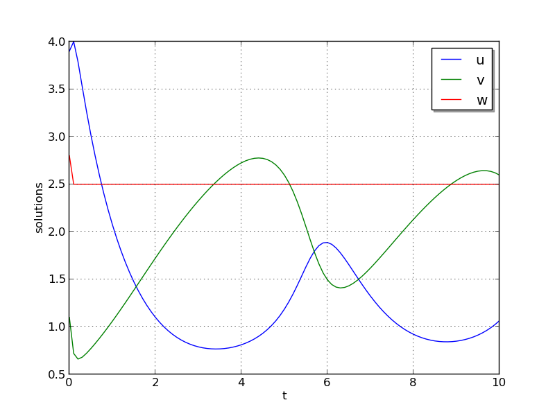

..
   Programmer(s): Daniel R. Reynolds @ SMU
   ----------------------------------------------------------------
   SUNDIALS Copyright Start
   Copyright (c) 2002-2021, Lawrence Livermore National Security
   and Southern Methodist University.
   All rights reserved.

   See the top-level LICENSE and NOTICE files for details.

   SPDX-License-Identifier: BSD-3-Clause
   SUNDIALS Copyright End
   ----------------------------------------------------------------

:tocdepth: 3

.. _serial_f90:

====================================
Serial Fortran 90 example problems
====================================

.. _ark_bruss:

ark_bruss
===================================================

This test problem is a Fortran-90 version of the same brusselator
problem as before, :ref:`ark_brusselator`, in which the "test 1"
parameters are hard-coded into the solver.  As with the previous test,
this problem has 3 dependent variables :math:`u`, :math:`v` and
:math:`w`, that depend on the independent variable :math:`t` via the
IVP system

.. math::

   \frac{du}{dt} &= a - (w+1)u + v u^2, \\
   \frac{dv}{dt} &= w u - v u^2, \\
   \frac{dw}{dt} &= \frac{b-w}{\varepsilon} - w u.

We integrate over the interval :math:`0 \le t \le 10`, with the
initial conditions :math:`u(0) = 3.9`, :math:`v(0) = 1.1`, 
:math:`w(0) = 2.8`, and parameters :math:`a=1.2`, :math:`b=2.5` and
:math:`\varepsilon=10^{-5}`.  After each unit time interval, the
solution is output to the screen.

Numerical method
----------------

Since this driver and utility functions are written in Fortran-90,
this example demonstrates the use of the FARKODE interface for the
ARKode solver.  For time integration, this example uses the
fourth-order additive Runge-Kutta IMEX method, where the right-hand
sides are broken up as

.. math::

   f_E(t,u,v,w) = \left(\begin{array}{c} a - (w+1)u + v u^2 \\ 
     w u - v u^2 \\ - w u  \end{array}\right), \quad\text{and}\quad 
   f_I(t,u,v,w) = \left(\begin{array}{c} 0\\0\\
     \frac{b-w}{\varepsilon}\end{array}\right). 

The implicit systems are solved using the built-in modified Newton
iteration, with the SUNMATRIX_DENSE matrix module and accompanying
SUNLINSOL_DENSE linear solver module, through the ARKDLS interface.
Both the Jacobian routine and right-hand side functions are supplied
by functions provided in the example file.

The only non-default solver options are the tolerances
:math:`atol=10^{-10}` and :math:`rtol=10^{-6}`, adaptivity method 2 (I
controller), a maximum of 8 Newton iterations per step, a nonlinear
solver convergence coefficient :math:`nlscoef=10^{-8}`, and a maximum
of 1000 internal time steps.

   

Solutions
---------

With this setup, all three solution components exhibit a rapid
transient change during the first 0.2 time units, followed by a slow
and smooth evolution, as seen in the figure below.  Note that these
results identically match those from the previous C example with the
same equations.  

.. _ark_bruss1D_FEM_klu:

ark_bruss1D_FEM_klu
===================================================

This problem is mathematically identical to the C example problem
:ref:`ark_brusselator1D_FEM_slu`, but is written in Fortran 90, stores
the sparse Jacobian and mass matrices in compressed-sparse-row format,
and uses the KLU sparse-direct linear solver.

           
