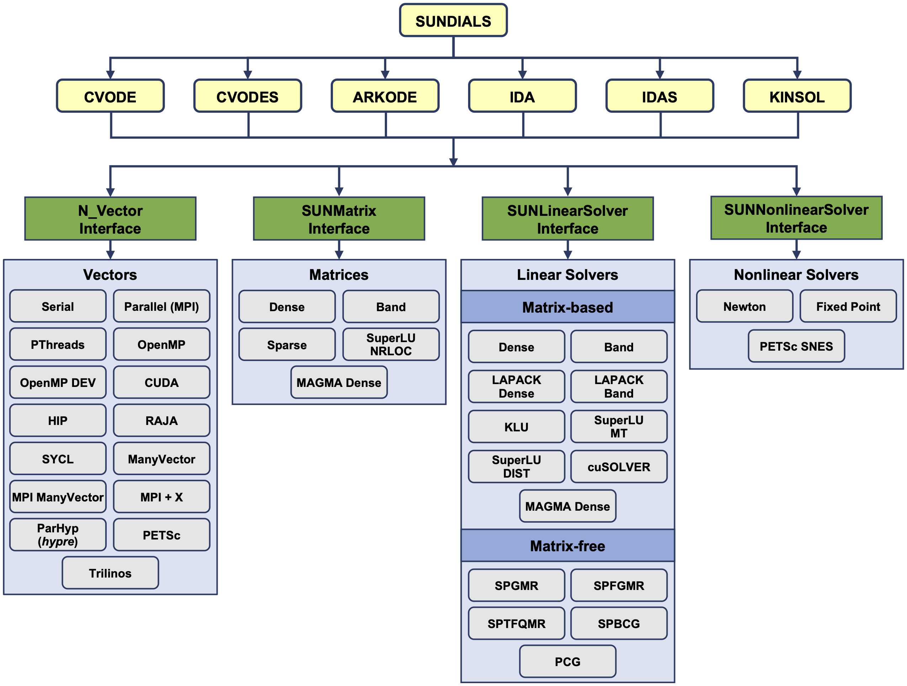
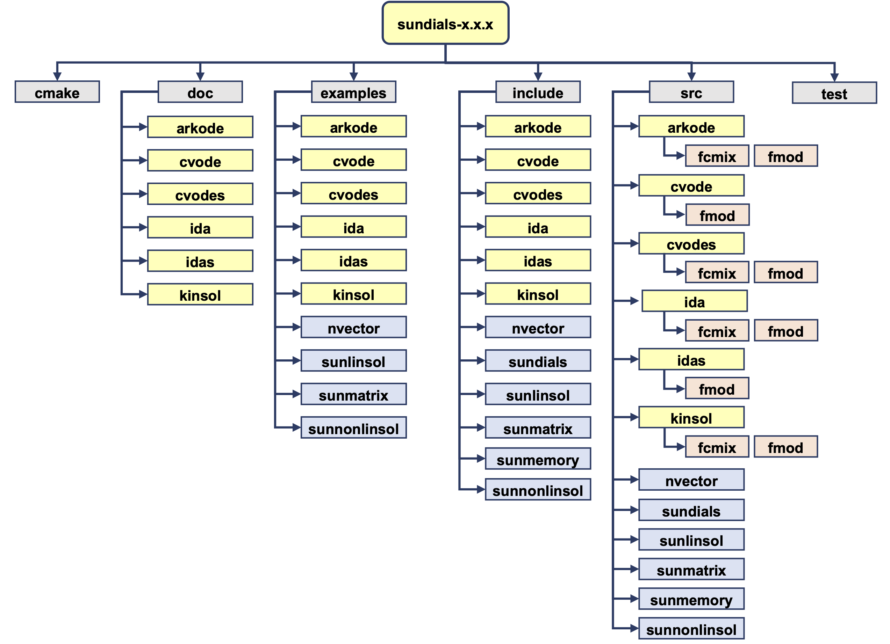

..
   Programmer(s): Daniel R. Reynolds @ SMU
   ----------------------------------------------------------------
   SUNDIALS Copyright Start
   Copyright (c) 2002-2021, Lawrence Livermore National Security
   and Southern Methodist University.
   All rights reserved.

   See the top-level LICENSE and NOTICE files for details.

   SPDX-License-Identifier: BSD-3-Clause
   SUNDIALS Copyright End
   ----------------------------------------------------------------

:tocdepth: 3

.. _Organization:

=================
Code Organization
=================

The family of solvers referred to as SUNDIALS consists of the solvers
CVODE and ARKode (for ODE systems), KINSOL (for nonlinear algebraic
systems), and IDA (for differential-algebraic systems).  In addition,
SUNDIALS also includes variants of CVODE and IDA with sensitivity analysis
capabilities (using either forward or adjoint methods), called CVODES and
IDAS, respectively.

The various solvers of this family share many subordinate modules.
For this reason, it is organized as a family, with a directory
structure that exploits that sharing (see the following Figures
:ref:`SUNDIALS organization <sunorg1>` and :ref:`SUNDIALS tree <sunorg2>`).
The following is a list of the solver packages presently available, and the
basic functionality of each:

- CVODE, a linear multistep solver for stiff and nonstiff ODE systems
  :math:`\dot{y} = f(t,y)` based on Adams and BDF methods;
- CVODES, a linear multistep solver for stiff and nonstiff ODEs with
  sensitivity analysis capabilities;
- ARKode, a Runge-Kutta based solver for stiff, nonstiff, mixed stiff-nonstiff,
  and multirate ODE systems;
- IDA, a linear multistep solver for differential-algebraic systems
  :math:`F(t,y,\dot{y}) = 0` based on BDF methods;
- IDAS, a linear multistep solver for differential-algebraic systems with sensitivity
  analysis capabilities;
- KINSOL, a solver for nonlinear algebraic systems :math:`F(u) = 0`.

Note for modules that provide interfaces to third-party libraries (i.e., LAPACK,
KLU, SuperLU_MT, SuperLU_DIST, *hypre*, PETSc, Trilinos, and RAJA users will
need to download and compile those packages independently.

.. _sunorg1:

   *SUNDIALS organization*: High-level diagram of the SUNDIALS structure

.. _sunorg2:

   *SUNDIALS tree*: Directory structure of the source tree.

ARKode organization
==========================

The ARKode package is written in the ANSI C language.  The
following summarizes the basic structure of the package, although
knowledge of this structure is not necessary for its use.

The overall organization of the ARKode package is shown in Figure
:ref:`ARKode organization <arkorg>`.  The central integration modules,
implemented in the files ``arkode.h``, ``arkode_impl.h``,
``arkode_butcher.h``, ``arkode.c``, ``arkode_arkstep.c`` ,
``arkode_erkstep.c``, ``arkode_mristep.h``, and ``arkode_butcher.c``, deal with
the evaluation of integration stages, the nonlinear solvers, estimation of
the local truncation error, selection of step size, and interpolation
to user output points, among other issues.  ARKode currently supports
modified Newton, inexact Newton, and accelerated fixed-point solvers
for these nonlinearly implicit problems.  However, when using the
Newton-based iterations, or when using a non-identity mass matrix
:math:`M\ne I`, ARKode has flexibility in the choice of method used to
solve the linear sub-systems that arise.  Therefore, for any user
problem invoking the Newton solvers, or any user problem with
:math:`M\ne I`, one (or more) of the linear system solver modules
should be specified by the user, which is then invoked as needed
during the integration process.

.. _arkorg:

.. figure:: figs/arkorg.png

   *ARKode organization*: Overall structure of the ARKode package.
   Modules specific to ARKode are the timesteppers (ARKODE), linear solver
   interfaces (ARKLS), nonlinear solver interfaces (ARKNLS), and preconditioners
   (ARKBANDPRE and ARKBBDPRE); all other items correspond to generic SUNDIALS
   vector, matrix, and solver modules.

For solving these linear systems, ARKode's linear solver interface
supports both direct and iterative linear solvers built using the
generic SUNLINSOL API (see :ref:`SUNLinSol`).  These solvers may
utilize a SUNMATRIX object for storing Jacobian information, or they
may be matrix-free.  Since ARKode can operate on any valid SUNLINSOL
implementation, the set of linear solver modules available to ARKode
will expand as new SUNLINSOL modules are developed.

For users employing dense or banded Jacobians, ARKode includes
algorithms for their approximation  through difference quotients,
although the user also has the option of supplying a routine to
compute the Jacobian (or an approximation to it) directly.  This
user-supplied routine is required when using sparse or user-supplied
Jacobian matrices.

For users employing iterative linear solvers, ARKode includes an
algorithm for the approximation by difference quotients of the product
:math:`Av`. Again, the user has the option of providing routines for
this operation, in two phases: setup (preprocessing of Jacobian data)
and multiplication.

When solve problems with non-identity mass matrices, corresponding
user-supplied routines for computing either the mass matrix :math:`M`
or the product :math:`Mv` are required.  Additionally, the type of
linear solver module (iterative, dense-direct, band-direct,
sparse-direct) used for both the IVP system and mass matrix must
match.

For preconditioned iterative methods for either the system or mass
matrix solves, the preconditioning must be supplied by the user, again
in two phases: setup and solve.  While there is no default choice of
preconditioner analogous to the difference-quotient approximation in
the direct case, the references [BH1989]_ and [B1992]_, together with
the example and demonstration programs included with ARKode and CVODE,
offer considerable assistance in building simple preconditioners.

ARKode's linear solver interface consists of four primary phases,
devoted to

(1) memory allocation and initialization,
(2) setup of the matrix/preconditioner data involved,
(3) solution of the system, and
(4) freeing of memory.

The setup and solution phases are separate because the evaluation of
Jacobians and preconditioners is done only periodically during the
integration process, and only as required to achieve convergence.

ARKode also provides two rudimentary preconditioner modules, for
use with any of the Krylov iterative linear solvers.  The first,
ARKBANDPRE is intended to be used with the serial or threaded vector
data structures (NVECTOR_SERIAL, NVECTOR_OPENMP and NVECTOR_PTHREADS),
and provides a banded difference-quotient approximation to the
Jacobian as the preconditioner, with corresponding setup and solve
routines.  The second preconditioner module, ARKBBDPRE, is intended to
work with the parallel vector data structure, NVECTOR_PARALLEL, and
generates a preconditioner that is a block-diagonal matrix with each
block being a band matrix owned by a single processor.

All state information used by ARKode to solve a given problem is
saved in a single opaque memory structure, and a pointer to that
structure is returned to the user.  For C and C++ applications there
is no global data in the ARKode package, and so in this respect it is
reentrant.  State information specific to the linear solver interface
is saved in a separate data structure, a pointer to which resides in
the ARKode memory structure.  State information specific to the linear
solver implementation (and matrix implementation, if applicable) are
stored in their own data structures, that are returned to the user
upon construction, and subsequently provided to ARKode for use.  We
note that the ARKode Fortran interface, however, currently uses global
variables, so at most one of each of these objects may be created per
memory space (i.e. one per MPI task in distributed memory
computations).
