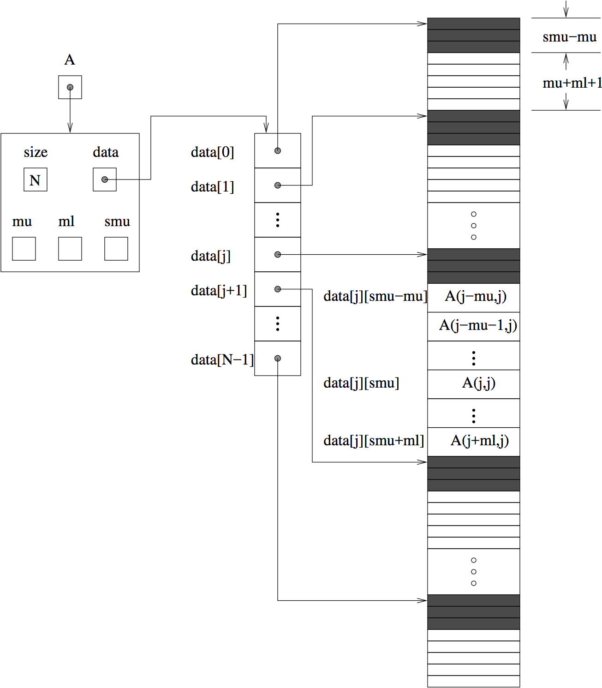

..
   Programmer(s): Daniel R. Reynolds @ SMU
   ----------------------------------------------------------------
   SUNDIALS Copyright Start
   Copyright (c) 2002-2020, Lawrence Livermore National Security
   and Southern Methodist University.
   All rights reserved.

   See the top-level LICENSE and NOTICE files for details.

   SPDX-License-Identifier: BSD-3-Clause
   SUNDIALS Copyright End
   ----------------------------------------------------------------

:tocdepth: 3

.. _SUNMatrix_Band:

The SUNMATRIX_BAND Module
======================================

The banded implementation of the ``SUNMatrix`` module provided with
SUNDIALS, SUNMATRIX_BAND, defines the *content* field of
``SUNMatrix`` to be the following structure:

.. code-block:: c

   struct _SUNMatrixContent_Band {
     sunindextype M;
     sunindextype N;
     sunindextype mu;
     sunindextype ml;
     sunindextype smu;
     sunindextype ldim;
     realtype *data;
     sunindextype ldata;
     realtype **cols;
   };

A diagram of the underlying data representation in a banded matrix is
shown in Figure :ref:`SUNBandMatrix Diagram <SUNBandMatrix>`.  A more
complete description of the parts of this *content* field is given below:

* ``M`` - number of rows

* ``N`` - number of columns (``N`` = ``M``)

* ``mu`` - upper half-bandwidth, :math:`0 \le \text{mu} < N`

* ``ml`` - lower half-bandwidth, :math:`0 \le \text{ml} < N`

* ``smu`` - storage upper bandwidth, :math:`\text{mu} \le \text{smu} < N`.
  The LU decomposition routines in the associated SUNLINSOL_BAND
  and SUNLINSOL_LAPACKBAND modules write the LU factors into the
  existing storage for the band matrix. The upper triangular factor
  U, however, may have an upper bandwidth as big as
  ``min(N-1, mu+ml)`` because of partial pivoting. The ``smu`` field
  holds the upper half-bandwidth allocated for the band matrix.

* ``ldim`` - leading dimension (:math:`\text{ldim} \ge smu + ml + 1`)

* ``data`` - pointer to a contiguous block of ``realtype`` variables.
  The elements of the banded matrix are stored columnwise
  (i.e. columns are stored one on top of the other in memory). Only
  elements within the specified half-bandwidths are stored.  ``data``
  is a pointer to ``ldata`` contiguous locations which hold the
  elements within the banded matrix.

* ``ldata`` - length of the data array (:math:`= \text{ldim} \cdot N`)

* ``cols`` - array of pointers. ``cols[j]`` is a pointer to the
  uppermost element within the band in the j-th column. This pointer
  may be treated as an array indexed from
  ``smu-mu`` (to access the uppermost element within the band in the
  j-th column) to ``smu+ml`` (to access the lowest element within the
  band in the j-th column). Indices from 0 to ``smu-mu-1`` give access
  to extra storage elements required by the LU decomposition function.
  Finally, ``cols[j][i-j+smu]`` is the (:math:`i,j`)-th element with
  :math:`j-\text{mu} \le i \le j+\text{ml}`.

.. _SUNBandMatrix:

   Diagram of the storage for the SUNMATRIX_BAND module. Here ``A`` is an
   :math:`N \times N` band matrix with upper and lower half-bandwidths ``mu``
   and ``ml``, respectively. The rows and columns of ``A`` are
   numbered from 0 to ``N-1`` and the (:math:`i,j`)-th element of ``A`` is
   denoted ``A(i,j)``. The greyed out areas of the underlying
   component storage are used by the associated SUNLINSOL_BAND or
   SUNLINSOL_LAPACKBAND linear solver.

The header file to be included when using this module is
``sunmatrix/sunmatrix_band.h``.

The following macros are provided to access the
content of a SUNMATRIX_BAND matrix. The prefix ``SM_`` in the names
denotes that these macros are for *SUNMatrix* implementations,
and the suffix ``_B`` denotes that these are specific to
the *banded* version.

.. c:macro:: SM_CONTENT_B(A)

   This macro gives access to the contents of the banded ``SUNMatrix`` *A*.

   The assignment ``A_cont = SM_CONTENT_B(A)`` sets
   ``A_cont`` to be a pointer to the banded ``SUNMatrix`` content
   structure.

   Implementation:

   .. code-block:: c

      #define SM_CONTENT_B(A)   ( (SUNMatrixContent_Band)(A->content) )

.. c:macro:: SM_ROWS_B(A)

   Access the number of rows in the banded ``SUNMatrix`` *A*.

   This may be used either to retrieve or to set the value.  For
   example, the assignment ``A_rows = SM_ROWS_B(A)`` sets ``A_rows`` to be
   the number of rows in the matrix ``A``.  Similarly, the
   assignment ``SM_ROWS_B(A) = A_rows`` sets the number of
   columns in ``A`` to equal ``A_rows``.

   Implementation:

   .. code-block:: c

      #define SM_ROWS_B(A)   ( SM_CONTENT_B(A)->M )

.. c:macro:: SM_COLUMNS_B(A)

   Access the number of columns in the banded ``SUNMatrix`` *A*.  As
   with ``SM_ROWS_B``, this may be used either to retrieve or to set
   the value.

   Implementation:

   .. code-block:: c

      #define SM_COLUMNS_B(A)   ( SM_CONTENT_B(A)->N )

.. c:macro:: SM_UBAND_B(A)

   Access the ``mu`` parameter in the banded ``SUNMatrix`` *A*.  As
   with ``SM_ROWS_B``, this may be used either to retrieve or to set
   the value.

   Implementation:

   .. code-block:: c

      #define SM_UBAND_B(A)   ( SM_CONTENT_B(A)->mu )

.. c:macro:: SM_LBAND_B(A)

   Access the ``ml`` parameter in the banded ``SUNMatrix`` *A*.  As
   with ``SM_ROWS_B``, this may be used either to retrieve or to set
   the value.

   Implementation:

   .. code-block:: c

      #define SM_LBAND_B(A)   ( SM_CONTENT_B(A)->ml )

.. c:macro:: SM_SUBAND_B(A)

   Access the ``smu`` parameter in the banded ``SUNMatrix`` *A*.  As
   with ``SM_ROWS_B``, this may be used either to retrieve or to set
   the value.

   Implementation:

   .. code-block:: c

      #define SM_SUBAND_B(A)   ( SM_CONTENT_B(A)->smu )

.. c:macro:: SM_LDIM_B(A)

   Access the ``ldim`` parameter in the banded ``SUNMatrix`` *A*.  As
   with ``SM_ROWS_B``, this may be used either to retrieve or to set
   the value.

   Implementation:

   .. code-block:: c

      #define SM_LDIM_B(A)   ( SM_CONTENT_B(A)->ldim )

.. c:macro:: SM_LDATA_B(A)

   Access the ``ldata`` parameter in the banded ``SUNMatrix`` *A*.  As
   with ``SM_ROWS_B``, this may be used either to retrieve or to set
   the value.

   Implementation:

   .. code-block:: c

      #define SM_LDATA_B(A)   ( SM_CONTENT_B(A)->ldata )

.. c:macro:: SM_DATA_B(A)

   This macro gives access to the ``data`` pointer for the matrix entries.

   The assignment ``A_data = SM_DATA_B(A)`` sets ``A_data`` to be
   a pointer to the first component of the data array for the banded
   ``SUNMatrix A``.  The assignment ``SM_DATA_B(A) = A_data``
   sets the data array of ``A`` to be ``A_data`` by storing the
   pointer ``A_data``.

   Implementation:

   .. code-block:: c

      #define SM_DATA_B(A)   ( SM_CONTENT_B(A)->data )

.. c:macro:: SM_COLS_B(A)

   This macro gives access to the ``cols`` pointer for the matrix entries.

   The assignment ``A_cols = SM_COLS_B(A)`` sets ``A_cols`` to be
   a pointer to the array of column pointers for the banded ``SUNMatrix A``.
   The assignment ``SM_COLS_B(A) = A_cols`` sets the column pointer
   array of ``A`` to be ``A_cols`` by storing the pointer
   ``A_cols``.

   Implementation:

   .. code-block:: c

      #define SM_COLS_B(A)   ( SM_CONTENT_B(A)->cols )

.. c:macro:: SM_COLUMN_B(A)

   This macros gives access to the individual columns of the data
   array of a banded ``SUNMatrix``.

   The assignment ``col_j = SM_COLUMN_B(A,j)`` sets ``col_j`` to be
   a pointer to the diagonal element of the j-th column of the
   :math:`N \times N` band matrix ``A``, :math:`0 \le j \le N-1`.
   The type of the expression ``SM_COLUMN_B(A,j)`` is ``realtype *``.
   The pointer returned by the call ``SM_COLUMN_B(A,j)`` can be treated as
   an array which is indexed from ``-mu`` to ``ml``.

   Implementation:

   .. code-block:: c

      #define SM_COLUMN_B(A,j)   ( ((SM_CONTENT_B(A)->cols)[j])+SM_SUBAND_B(A) )

.. c:macro:: SM_ELEMENT_B(A)

   This macro gives access to the individual entries of the data array
   of a banded ``SUNMatrix``.

   The assignments ``SM_ELEMENT_B(A,i,j) = a_ij`` and ``a_ij =
   SM_ELEMENT_B(A,i,j)`` reference the (:math:`i,j`)-th element of the
   :math:`N \times N` band matrix ``A``, where :math:`0 \le i,j \le N-1`.
   The location (:math:`i,j`) should further satisfy
   :math:`j-\text{mu} \le i \le j+\text{ml}`.

   Implementation:

   .. code-block:: c

      #define SM_ELEMENT_B(A,i,j)   ( (SM_CONTENT_B(A)->cols)[j][(i)-(j)+SM_SUBAND_B(A)] )

.. c:macro:: SM_COLUMN_ELEMENT_B(A)

   This macro gives access to the individual entries of the data array
   of a banded ``SUNMatrix``.

   The assignments ``SM_COLUMN_ELEMENT_B(col_j,i,j) = a_ij`` and
   ``a_ij = SM_COLUMN_ELEMENT_B(col_j,i,j)`` reference the
   (:math:`i,j`)-th entry of the band matrix ``A`` when used in
   conjunction with ``SM_COLUMN_B`` to reference the j-th column
   through ``col_j``. The index (:math:`i,j`) should satisfy
   :math:`j-\text{mu} \le i \le j+\text{ml}`.

   Implementation:

   .. code-block:: c

      #define SM_COLUMN_ELEMENT_B(col_j,i,j)   (col_j[(i)-(j)])

The SUNMATRIX_BAND module defines banded implementations of all matrix
operations listed in the section :ref:`SUNMatrix.Ops`. Their names are
obtained from those in that section by appending the suffix ``_Band``
(e.g. ``SUNMatCopy_Band``).  The module SUNMATRIX_BAND provides the
following additional user-callable routines:

.. c:function:: SUNMatrix SUNBandMatrix(sunindextype N, sunindextype mu, sunindextype ml)

   This constructor function creates and allocates memory for a banded ``SUNMatrix``.
   Its arguments are the matrix size, ``N``, and the upper and lower
   half-bandwidths of the matrix, ``mu`` and ``ml``.  The stored upper
   bandwidth is set to ``mu+ml`` to accommodate subsequent
   factorization in the SUNLINSOL_BAND and SUNLINSOL_LAPACKBAND
   modules.

.. c:function:: SUNMatrix SUNBandMatrixStorage(sunindextype N, sunindextype mu, sunindextype ml, sunindextype smu)

   This constructor function creates and allocates memory for a banded ``SUNMatrix``.
   Its arguments are the matrix size, ``N``, the upper and lower
   half-bandwidths of the matrix, ``mu`` and ``ml``, and the stored
   upper bandwidth, ``smu``.  When creating a band ``SUNMatrix``,
   this value should be

   * at least ``min(N-1,mu+ml)`` if the matrix will be
     used by the SUNLinSol_Band module;

   * exactly equal to ``mu+ml`` if the matrix will be used by
     the SUNLinSol_LapackBand module;

   * at least ``mu`` if used in some other manner.

   *Note: it is strongly recommended that users call the default
   constructor, :c:func:`SUNBandMatrix()`, in all standard use cases.
   This advanced constructor is used internally within SUNDIALS
   solvers, and is provided to users who require banded matrices for
   non-default purposes.*

.. c:function:: void SUNBandMatrix_Print(SUNMatrix A, FILE* outfile)

   This function prints the content of a banded ``SUNMatrix`` to the
   output stream specified by ``outfile``.  Note: ``stdout``
   or ``stderr`` may be used as arguments for ``outfile`` to print
   directly to standard output or standard error, respectively.

.. c:function:: sunindextype SUNBandMatrix_Rows(SUNMatrix A)

   This function returns the number of rows in the banded ``SUNMatrix``.

.. c:function:: sunindextype SUNBandMatrix_Columns(SUNMatrix A)

   This function returns the number of columns in the banded ``SUNMatrix``.

.. c:function:: sunindextype SUNBandMatrix_LowerBandwidth(SUNMatrix A)

   This function returns the lower half-bandwidth for the banded ``SUNMatrix``.

.. c:function:: sunindextype SUNBandMatrix_UpperBandwidth(SUNMatrix A)

   This function returns the upper half-bandwidth of the banded ``SUNMatrix``.

.. c:function:: sunindextype SUNBandMatrix_StoredUpperBandwidth(SUNMatrix A)

   This function returns the stored upper half-bandwidth of the banded ``SUNMatrix``.

.. c:function:: sunindextype SUNBandMatrix_LDim(SUNMatrix A)

   This function returns the length of the leading dimension of the banded ``SUNMatrix``.

.. c:function:: realtype* SUNBandMatrix_Data(SUNMatrix A)

   This function returns a pointer to the data array for the banded ``SUNMatrix``.

.. c:function:: realtype** SUNBandMatrix_Cols(SUNMatrix A)

   This function returns a pointer to the cols array for the band ``SUNMatrix``.

.. c:function:: realtype* SUNBandMatrix_Column(SUNMatrix A, sunindextype j)

   This function returns a pointer to the diagonal entry of the j-th
   column of the banded ``SUNMatrix``.  The resulting pointer should
   be indexed over the range ``-mu`` to ``ml``.

**Notes**

* When looping over the components of a banded ``SUNMatrix A``,
  the most efficient approaches are to:

  * First obtain the component array via ``A_data = SM_DATA_B(A)`` or
    ``A_data = SUNBandMatrix_Data(A)`` and then
    access ``A_data[i]`` within the loop.

  * First obtain the array of column pointers via ``A_cols = SM_COLS_B(A)`` or
    ``A_cols = SUNBandMatrix_Cols(A)``, and then
    access ``A_cols[j][i]`` within the loop.

  * Within a loop over the columns, access the column pointer via
    ``A_colj = SUNBandMatrix_Column(A,j)`` and then to access the
    entries within that column using ``SM_COLUMN_ELEMENT_B(A_colj,i,j)``.

  All three of these are more efficient than
  using ``SM_ELEMENT_B(A,i,j)`` within a double loop.

* Within the ``SUNMatMatvec_Band`` routine, internal consistency
  checks are performed to ensure that the matrix is called with
  consistent ``N_Vector`` implementations.  These are currently
  limited to: NVECTOR_SERIAL, NVECTOR_OPENMP, and NVECTOR_PTHREADS.
  As additional compatible vector implementations are added to
  SUNDIALS, these will be included within this compatibility check.

For solvers that include a Fortran interface module, the SUNMATRIX_BAND
module also includes the Fortran-callable function
:f:func:`FSUNBandMatInit()` to initialize this SUNMATRIX_BAND module
for a given SUNDIALS solver.

.. f:subroutine:: FSUNBandMatInit(CODE, N, MU, ML, IER)

   Initializes a band ``SUNMatrix`` structure for use in a SUNDIALS solver.

   **Arguments:**
      * *CODE* (``int``, input) -- flag denoting the SUNDIALS solver
        this matrix will be used for: CVODE=1, IDA=2, KINSOL=3, ARKode=4.
      * *N* (``long int``, input) -- number of matrix rows (and columns).
      * *MU* (``long int``, input) -- upper half-bandwidth.
      * *ML* (``long int``, input) -- lower half-bandwidth.
      * *IER* (``int``, output) -- return flag (0 success, -1 for failure).

Additionally, when using ARKode with a non-identity mass matrix, the
Fortran-callable function :f:func:`FSUNBandMassMatInit()` initializes
this SUNMATRIX_BAND module for storing the mass matrix.

.. f:subroutine:: FSUNBandMassMatInit(N, MU, ML, IER)

   Initializes a band ``SUNMatrix`` structure for use as a mass
   matrix in ARKode.

   **Arguments:**
      * *N* (``long int``, input) -- number of matrix rows (and columns).
      * *MU* (``long int``, input) -- upper half-bandwidth.
      * *ML* (``long int``, input) -- lower half-bandwidth.
      * *IER* (``int``, output) -- return flag (0 success, -1 for failure).
